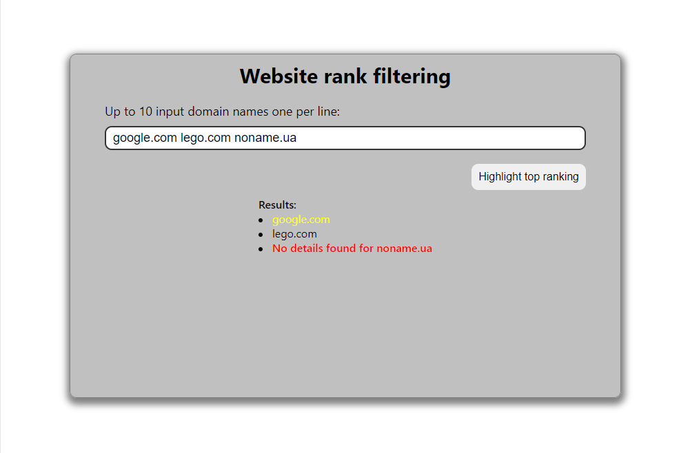

# Running this project

This repository contains sample code on how to use [Redis](https://redis.io) for a caching of requests implementation with [Redis](https://redis.io) and the Node.js [express](https://expressjs.com/) framework. Also the repository includes Cypress tests.

### 1. Installing Redis

Make sure that you have _[Redis](https://redis.io) running locally_ on your machine on its _default_ port `6379`.
This project assumes that your [Redis](https://redis.io) instance does _not require a password_ (which is the default).
If your local [Redis](https://redis.io) requires a password, please update the `redisClient` to include the password field:

```
const redisClient = redis.createClient({
    port: 6379,
    host: 'localhost',
    password: 'your-password'
});
```

1.To start the redis-server enter in your wsl terminal:

```
 sudo service redis-server start

```

2.Then enter redis-cli in your wsl terminal. The program will start in interactive mode. You can type different commands and see their replies.

```
redis-cli

```

3.To check saved keys in Redis use:

```
keys *

```

### 2. Install dependencies on client side

Run:

```
cd ../client
npm install
```

to install the project's dependencies.

### 3. Install dependencies on server side

Run:

```
cd ../server
npm install
```

to install the project's dependencies.

### 4. Start server

Execute the `start` script to start up your server.

```
cd ../server
npm start
```

### 5. Start React App

Execute the `start` script to start up your React App.

```
cd ../client
npm start
```

### 5. Start Cypress tests

Execute the `cypress open` script to start up your React App.

```
cd ../client
npm run cypress:open
```


